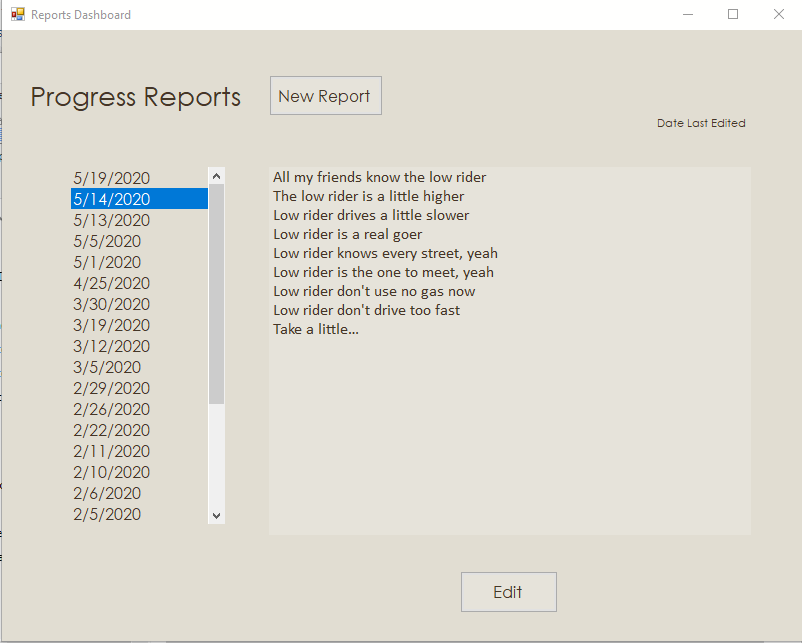

# DesktopReportsCapstone
## A Winforms compiled desktop app to record project progress reports

### Overview

This is **Part II** of a three-part group project for a Capstone course. My team mates were to research privacy and security needs for a fictitious company as relates to the new **Califronia Privacy Laws (CCPA)**. This app (and the [**related web app**](https://capstonewebapp.azurewebsites.net/)) was created for each team member to install on their own computers to create and edit research reports.

Part I of this project was a SQL database using Azure SQL (for cloud storage.) [**Part III**](https://github.com/drobinson-sudo/CapstoneWebApp) of this project is as ASP.Net web app to connect to the same database for viewing of reports.

### Scope

The scope of this desktop app was to have the ability to create and edit reports, cancel actions when necessary, persist the information in a database of our choosing, and display the reports in reverse chronological order.

I decided to contain all of those requirements in one single form, with buttons/actions available only when it made sense to use them. So, the "Save" and "Cancel" buttons are only visible when there is something to save or cancel, the "Edit" button is only visible when the app is not in Edit Mode.

### Of Special Note

There is an object class for the reports, and each report is handeled as an object. [**Dapper**](https://github.com/StackExchange/Dapper) is the ORM used to map the report objects to the database fields. 

There is a Data Access class with the methods needed to call the stored procedures in the SQL database, using input parameters defined in the SQL database.

The connection string user is defined in the Azure contained database and is limited to only using the parameterized stored procedures which were defined for this project.

### Conclusion

All in all, a very simple project, purposely kept tight in scope, as a requirement of the overall group project.(We were also graded on how close we stayed to our original scope documents from the beginning of the project.)
